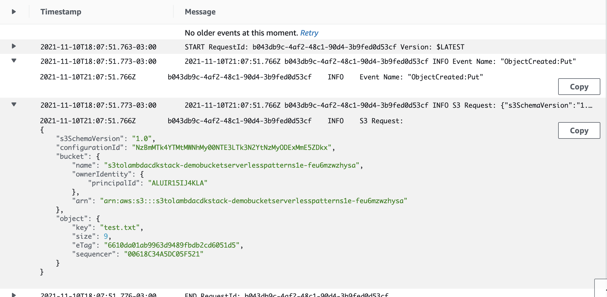

# S3 to Lambda

The CDK stack deploys a Lambda function, a S3 bucket, and the minimum IAM resources required to run the application.

When items are written or updated in the S3 bucket, the changes are sent to a stream. This pattern configures a Lambda function to poll this stream. The function is invoked with a payload containing the contents of the table item that changed.

Learn more about this pattern at Serverless Land Patterns: https://serverlessland.com/patterns/s3-lambda-cdk.

Important: this application uses various AWS services and there are costs associated with these services after the Free Tier usage - please see the [AWS Pricing page](https://aws.amazon.com/pricing/) for details. You are responsible for any AWS costs incurred. No warranty is implied in this example.

## Requirements

* [Create an AWS account](https://portal.aws.amazon.com/gp/aws/developer/registration/index.html) if you do not already have one and log in. The IAM user that you use must have sufficient permissions to make necessary AWS service calls and manage AWS resources.
* [AWS CLI](https://docs.aws.amazon.com/cli/latest/userguide/install-cliv2.html) installed and configured
* [Git Installed](https://git-scm.com/book/en/v2/Getting-Started-Installing-Git)
* [AWS Serverless Application Model](https://docs.aws.amazon.com/serverless-application-model/latest/developerguide/serverless-sam-cli-install.html) (AWS SAM) installed

## Deployment Instructions

1. Create a new directory, navigate to that directory in a terminal and clone the GitHub repository:
    ``` 
    git clone https://github.com/aws-samples/serverless-patterns
    ```
1. Change directory to the pattern directory:
    ```
    cd s3-lambda-cdk/src
    ```
1. From the command line, use AWS SAM to deploy the AWS resources for the pattern as specified in the template.yml file:
    ```
    sam deploy --guided
    ```
1. During the prompts:
    * Enter a stack name
    * Enter the desired AWS Region
    * Allow SAM CLI to create IAM roles with the required permissions.

    Once you have run `sam deploy --guided` mode once and saved arguments to a configuration file (samconfig.toml), you can use `sam deploy` in future to use these defaults.

1. Note the outputs from the SAM deployment process. These contain the resource names and/or ARNs which are used for testing.

## Testing

1. Run the following S3 CLI command to upload an image to the S3 bucket. Note, you must edit the {SourceBucketName} placeholder with the name of the S3 Bucket. This is provided in the stack outputs.

```bash
aws s3 cp './events/test.txt'  s3://{SourceBucketName}
```

2. Go to the [Cloudwatch Log Groups](https://console.aws.amazon.com/cloudwatch/home?#logsV2:log-groups) page and search for the function Lambda name created. The CDK deployment process outputs will print the value for the **S3ToLambdaCdkStack.LambdaFunctionArn**. If you are using the default one, the function name will be something like `S3ToLambdaCdkStack-readStream-*`, and the log group will be `/aws/lambda/S3ToLambdaCdkStack-readStream-*`

3. If you are able to see the logs with the Event name and request, everything is working properly.




## Cleanup
 
1. Delete the stack
    ```bash
    aws cloudformation delete-stack --stack-name STACK_NAME
    ```
1. Confirm the stack has been deleted
    ```bash
    aws cloudformation list-stacks --query "StackSummaries[?contains(StackName,'STACK_NAME')].StackStatus"
    ```
----
Copyright 2021 Amazon.com, Inc. or its affiliates. All Rights Reserved.

SPDX-License-Identifier: MIT-0
